# DSH Better Reasoning Effort

<p align="center">
  <picture>
    <source media="(prefers-color-scheme: dark)" srcset="docs/banner-dark.svg">
    
  </picture>
</p>

[](LICENSE)
[](https://www.npmjs.com/package/dsh-better-reasoning-effort)
[](https://www.npmjs.com/package/dsh-better-reasoning-effort)

[](https://awesome-dsh-plugin.com)

**English** | [中文](README.zh.md)

Reasoning-effort **and input-modality** editing for **third-party models** in DeepSeek Harness, edited right inside the official Models page card — plus a quick reasoning-effort slider inside the official composer model menu (adapted from [HanaAyane's dsh-reasoning-effort](https://github.com/HanaAyane/dsh-reasoning-effort), see [Acknowledgements](#acknowledgements)).

<p align="center">
  
</p>

<p align="center">
  
</p>

## Why

The `llm-pi-ai` adapter natively supports per-model `reasoningEfforts` and `input` declarations, but the official Models page editor deliberately keeps both fields out of reach. As a result, third-party models get **no thinking-level picker** in the composer, only the official DeepSeek API can set reasoning effort, hand-declared models are treated as **text-only**, and configuring any of this meant hand-writing `settings.yaml` blocks. This plugin brings both configuration surfaces back into the UI: edit inside the official model editor card, plus one-click auto-adapt.

## Features

- **In-page editor** — an "Options" block appears under each model row's disclosure on the official Models page (reasoning effort, input modalities, endpoint compatibility), committing with the card's own **Save**; changes stay pending until then, and **Cancel** discards them with the card's fields.
- **Auto-adapt** — one click fills recommended levels, wire spellings and modalities from a built-in knowledge base (65 entries across 15 vendors — see [Supported models](docs/supported-models.md)), wire-protocol inference, and a same-origin probe of the provider's raw `/models` listing, every suggestion labeled by confidence; reference capacities show as read-only hints you copy yourself.
- **Auto-fill** — models without a declaration are filled at boot and when added mid-session (opt out via `autofill: false` / `modalityAutofill: false`); explicit declarations, `false` and deliberately-unset markers are never touched.
- **Three intents** — all levels off = unset (back to inheritance); only `off` = disable reasoning; levels armed = write the declaration.
- **Composer slider** — the official model menu's body is replaced by an upstream-style effort slider (drag / keyboard, optimistic commit with rollback), with one model row opening the official model list; the official trigger stays untouched, and model switches keep your level through a per-session memory chain (issue #4's per-model default effort outranks it across sessions).
- **Composer model search** — a filter box above the official model list (provider / model / id tokens), always on.
- **Per-model default effort** — a "Default effort" picker on each model row, stored in the settings document; every new session starts the model there.
- **Request headers & `user-agent`** — a provider-card section edits the official `headers` field (masked, path-merged, Save-gated), and the plugin performs the `user-agent` override at the fetch layer per origin, because the official adapter reserves that name; same-origin `/models` probes are covered, conflicts are reported rather than guessed.
- **Defensive injection** — everything keys off the official page's DOM; if an official upgrade changes the structure, injection simply pauses and the official page is unaffected.
- Bilingual copy (中文 / English).

## Supported models

The auto-adapt knowledge base carries **65 curated entries across 15 vendors** (DeepSeek, OpenAI, Anthropic Claude, Gemini, Grok, Qwen, GLM, Kimi, Mistral, MiniMax, MiMo, Doubao, Hunyuan, Step, ERNIE — re-verified against official docs 2026-08/09, including vision-capable variants and no-effort-control families). The full table — match patterns, level → wire-spelling ladders, defaults, modalities, reference capacities — lives in **[docs/supported-models.md](docs/supported-models.md)** (generated from [`src/knowledge.ts`](src/knowledge.ts), the authoritative source). Unlisted models fall back to protocol inference + generic levels, adjustable by hand.

## Install

Requires DeepSeek Harness **`0.1.5-alpha.1` or later** (per-line peer ranges; the `0.1.2-rc` / `0.1.3-alpha` lines are no longer supported — use plugin `0.3.7` there). Compiled and gated against `0.1.7-rc.2`. The per-kernel seam re-checks behind this live in [docs/compatibility-notes.md](docs/compatibility-notes.md).

```bash
# from npm, under the dsh web profile
dsh plugin --profile web add dsh-better-reasoning-effort

# or from GitHub (source install; `lib/` builds via the prepare hook — the
# installer prints the `allowBuilds` key it needs, follow that and re-add)
dsh plugin --profile web add github:HaoyueQin/dsh-better-reasoning-effort

# or link a local checkout for development
npm install && npm run build
dsh plugin --profile web add link:D:/Project/dsh-better-reasoning-effort
```

Restart `dsh web` and hard-refresh the browser.

## Usage

1. Configure a third-party provider (API key etc.) on the official Models page.
2. Expand a model row: the editor block sits under the official capacity fields.
   - Check levels (off / minimal / low / medium / high / xhigh / max) and fill the wire values (e.g. give `high` the spelling `ultra`, and the gateway receives `ultra` when you pick High in the composer);
   - Toggle **Image input** under *Input modalities* to declare what the model accepts;
   - Click **Auto-adapt** to fill recommended levels and modalities — reference capacities show up as read-only hints you copy into the official fields yourself;
   - Any change is **pending** and lands when you press the card's own **Save**; **Cancel** (or a reload) discards it with the card's fields.
3. On a compatible protocol, the *Endpoint compatibility* section appears at the bottom — thinking budget field / vLLM priority on `openai-completions`, `max_output_tokens` handling on `openai-responses`.
4. All levels off + Save = unset the declaration; only `off` checked + Save = disable reasoning (`false`); *Clear declaration* + Save = back to inheriting the provider default.

Declared models are immediately selectable for reasoning effort in the composer, and image-declared models accept attachments end to end.

## Configuration

Optional on the plugin's profile row (values shown are the defaults):

```yaml
- insert:
    - id: dsh-better-reasoning-effort
      name: dsh-better-reasoning-effort
      config:
        autofill: true          # auto-fill undeclared models at boot
        modalityAutofill: true  # whether the boot fill also covers modalities
        probeTimeoutMs: 15000   # /models probe fetch timeout
        bootRetryDelaysMs: [1000, 2000, 4000, 8000, 16000, 30000]
        defaultGuard: true      # map effort-less calls on forced-thinking
                                # ladders to the vendor default
```

## How it works

```
Browser (lib/client.js)                  Host (lib/index.js)
├─ DOM injector                          └─ Auto-fill
│   MutationObserver on the models page      settings/document-updated →
│   → mounts EffortEditor in each            invalidates the host cache;
│     model row's disclosure                 browser idle pass fills models
├─ Composer injection
│   MutationObserver on the document
│   → ComposerSlider (root pane)
│   → model search box (model-list pane)
├─ EffortEditor (React component)             (knowledge base + inference)
│   level checkboxes / wire values /
│   input-modality toggle /
│   auto-adapt (zoned suggestions) / committed with the card's Save
│   └─ writes settings.mutate (llm-pi-ai)
```

- `suggestEfforts()` in `src/knowledge.ts` is the knowledge base + inference engine — a pure function shared by host and browser.
- `reconcile()` in `src/client/injection/models-page-editor.ts` locates model rows and mounts the editor; `src/client/index.ts` assembles the browser half, one module per seam in `src/client/injection/`.
- `createEditorApi()` in `src/client/ops.ts` writes the declarations via `settings.mutate`, preserving every other row field and retrying once on a revision conflict.

## Development

```bash
npm run typecheck   # tsc strict check on src
npm test            # vitest: knowledge / inference / autofill / DOM injection / writing
npm run build       # lib/*.js + lib/client.js (module-loader bundle)
```

Compiled and gated against the `0.1.7-rc.2` official packages; see [docs/compatibility-notes.md](docs/compatibility-notes.md) for the per-kernel records.

## Known limitations

- Injection depends on the official Models page's DOM (aria-label/class); an official upgrade may pause injection until adapted — the official page is unaffected meanwhile.
- The auto-adapt probe route answers **loopback and IP-literal hosts only** (the core `/api` Host-allowlist discipline without `trustedHosts`), and **never follows redirects** — a gateway listing its models only behind a 30x simply yields no endpoint evidence; Auto-adapt falls back to the knowledge base and protocol inference.
- `reasoningEfforts` declarations are suggestions — what an endpoint actually accepts is up to its docs; tweak in the UI. The knowledge base is not exhaustive; families without an effort ladder carry no entry at all.
- Endpoint-compatibility switches are never auto-filled by design: they describe a gateway, not a model.
- The modality vocabulary follows pi-ai's core (`text` / `image` today); wider gateway support (PDF, audio, video) is recorded per family until the core vocabulary grows.
- Name-heuristic modality advice (vision-flavored ids) is deliberately low-confidence and labeled as such.
- Self-hosted relays: auto-fill pins `supportsDeveloperRole: false` on routes no official host claims (some upstreams reject the `developer` role); explicit values are never overwritten.
- Forced-thinking models (ladders without `off`, e.g. GLM-5.3): effort-less calls map to the vendor default instead of sending `thinking: disabled` — set `defaultGuard: false` to restore raw behavior.
- **Credentials inside `headers` are not redacted on disk**: the read-only view masks them, but the settings document still holds them in clear text — treat it like an API key.
- **The request-header section's edit-state detection reads an unofficial signal** (the official row exposes no data attribute for its editor state); if an official build renames that class root, the section stops appearing — never breaking the page.
- **Only one `user-agent` rewrite should be active**: sibling header plugins land on the same layer; the plugin detects and reports known ones, but the last writer on the wire wins.
- The request-layer takeover relies on the official adapter creating a fresh SDK client per request — guarded by an end-to-end test that fails loudly if that changes.

## Acknowledgements

The composer slider is **adapted from [dsh-reasoning-effort](https://github.com/HanaAyane/dsh-reasoning-effort) by [HanaAyane](https://github.com/HanaAyane)** (MIT) — thank you for the original work and the codex-style effort control idea. This integration keeps the upstream session-selection contract and slider interaction, with deliberate changes: a white round thumb only (no chibi-runner knob), the official model seat never replaced, and placement on the `0.1.5-alpha`+ line as a reduced re-implementation over the harness wire contract. If you used the upstream plugin, remove it to avoid two effort controls on the same seat:

```bash
dsh plugin --profile web remove dsh-reasoning-effort
```

## Activity

[](https://gitstock.org/HaoyueQin/dsh-better-reasoning-effort/stock.svg)

## License

MIT
