# DSH Better Reasoning Effort

<p align="center">
  <picture>
    <source media="(prefers-color-scheme: dark)" srcset="docs/banner-zh-dark.svg">
    
  </picture>
</p>

[](LICENSE)
[](https://www.npmjs.com/package/dsh-better-reasoning-effort)
[](https://www.npmjs.com/package/dsh-better-reasoning-effort)

[](https://awesome-dsh-plugin.com)

[English](README.md) | **中文**

在 DeepSeek Harness 中为**第三方模型**编辑思考强度**与输入模态**——直接在官方「模型」页的编辑卡内完成；另有一个 Composer 官方模型菜单内的思考强度快捷滑块（改编自 [HanaAyane 的 dsh-reasoning-effort](https://github.com/HanaAyane/dsh-reasoning-effort)，见[致谢](#致谢)）。

<p align="center">
  
</p>

<p align="center">
  
</p>

## 为什么需要它

`llm-pi-ai` 适配器原生支持每模型声明 `reasoningEfforts` 与 `input`，但官方「模型」页编辑卡刻意不暴露这两个字段。于是第三方模型在 Composer 里**没有思考档位选择器**，只有官方 DeepSeek API 能设思考强度，手工声明的模型被当作**纯文本**，想配置只能手写 `settings.yaml` 块。本插件把这两份配置能力都搬回 UI：官方模型编辑卡内直接编辑，加一键自动适配。

## 特性

- **官方页内注入** — 官方「模型」页每个模型行的展开区内出现「选项」编辑块（思考强度、输入模态、端点兼容），随卡片自身的**「保存」**统一提交；改动即时进入待写入，「取消」则与卡片字段一起丢弃。
- **自动适配** — 一键填入推荐档位、线上取值与模态，来源是内置模型知识库（15 家厂商 65 个条目，见[支持的模型](docs/supported-models.md)）、线协议推断，以及对供应商原始 `/models` 列表的同源探测；每条建议标注置信度，参考容量以只读提示出现、自行照抄。
- **自动填充** — 未声明的模型在启动时补一份推荐声明，会话中新增的也会补写（`autofill: false` / `modalityAutofill: false` 可关）；已声明、显式 `false`、刻意撤销的标记一律不动。
- **三种意图** — 全不勾 = 取消声明（回到继承）；只勾 off = 禁用推理；勾选档位 = 写入声明。
- **Composer 思考强度滑块** — 官方模型菜单的弹出体被替换为上游风格的档位滑块（拖动 / 键盘，乐观提交、被拒回滚），附一行模型条目打开官方模型列表；右下角触发钮保持原样。切换模型会通过会话记忆链沿用你的档位（issue #4 的每模型默认档跨会话优先）。
- **Composer 模型搜索** — 官方模型列表上方注入过滤框（供应商 / 模型 / ID 分词匹配），恒开。
- **每模型默认思考强度** — 模型行上的「默认思考强度」选择器，存在设置文档里，每个新会话打开该模型即用它。
- **请求头与 User-Agent** — 提供商卡片内编辑官方的 `headers` 字段（掩码显示、路径合并、随卡片保存），并在 fetch 层按 origin 精确接管 `user-agent` 的覆盖（官方适配器保留该名称）；同源 `/models` 探测一并覆盖，冲突时提示而不猜。
- **防御式注入** — 一切锚定官方页 DOM；官方升级改变结构时注入自动暂停，官方页不受影响。
- 双语文案（中文 / English）。

## 支持的模型

自动适配知识库内置 **15 家厂商 65 个条目**（DeepSeek、OpenAI、Anthropic Claude、Gemini、Grok、Qwen、GLM、Kimi、Mistral、MiniMax、MiMo、豆包、混元、阶跃、文心——2026-08/09 逐条对照官方文档复核，含视觉变体与无档位控制家族）。完整表格——匹配写法、档位 → 线上取值阶梯、默认档、模态、参考容量——见 **[docs/supported-models.md](docs/supported-models.md)**（由 [`src/knowledge.ts`](src/knowledge.ts) 生成，代码是权威数据源）。未列出的模型回退到协议推断 + 通用档位，可手动调整。

## 安装

需要 DeepSeek Harness **`0.1.5-alpha.1` 或更高**（按行联合的 peer 范围；`0.1.2-rc` / `0.1.3-alpha` 线不再支持——请使用插件 `0.3.7`）。当前对照 `0.1.7-rc.2` 编译与门禁。逐内核 seam 核查记录见 [docs/compatibility-notes.md](docs/compatibility-notes.md)。

```bash
# npm 安装（dsh 的 web profile 下）
dsh plugin --profile web add dsh-better-reasoning-effort

# 或从 GitHub（源码安装；`lib/` 由 prepare 钩子构建——安装器会打印需要的
# `allowBuilds` 键，照做后重新 add）
dsh plugin --profile web add github:HaoyueQin/dsh-better-reasoning-effort

# 或链接本地检出做开发
npm install && npm run build
dsh plugin --profile web add link:D:/Project/dsh-better-reasoning-effort
```

重启 `dsh web` 并强制刷新浏览器。

## 使用

1. 在官方「模型」页配置第三方供应商（API Key 等）。
2. 展开某个模型行：官方容量字段下方是编辑块。
   - 勾选档位（off / minimal / low / medium / high / xhigh / max），填线上取值（如给 `high` 填 `ultra`，Composer 选 High 时网关收到 `ultra`）；
   - 在「输入模态」区勾选**图片输入**，声明模型接受什么；
   - 点「自动适配」填推荐档位与模态——参考容量以只读提示出现，可自行照抄进官方输入框；
   - 改动**即时进入待写入**，点卡片自身的**「保存」**时一并落盘；**「取消」**（或刷新）则与卡片字段一起丢弃。
3. 协议兼容时，底部会出现「端点兼容」分区——`openai-completions` 上设思考预算字段 / vLLM 优先级，`openai-responses` 上设 `max_output_tokens` 的处理方式。
4. 全不勾 + 保存 = 取消声明（回到继承）；只勾 off + 保存 = 禁用推理（`false`）；模态行「清除声明」+ 保存 = 回到继承提供方默认。

声明后的模型在 Composer 里立即可选思考强度；声明了图片输入的模型可以端到端传附件。

## 配置

host 侧接受可选配置项（以下为默认值）：

```yaml
- insert:
    - id: dsh-better-reasoning-effort
      name: dsh-better-reasoning-effort
      config:
        autofill: true          # 启动时自动填充未声明的模型
        modalityAutofill: true  # 上述填充是否连带输入模态声明
        probeTimeoutMs: 15000   # /models 探测请求超时（毫秒）
        bootRetryDelaysMs: [1000, 2000, 4000, 8000, 16000, 30000]
        defaultGuard: true      # 强制思考梯子上的无档位调用落厂商默认档
```

## 工作方式（架构）

```
Browser (lib/client.js)                  Host (lib/index.js)
├─ DOM injector                          └─ Auto-fill
│   MutationObserver on the models page      settings/document-updated →
│   → mounts EffortEditor in each            invalidates the host cache;
│     model row's disclosure                 browser idle pass fills models
├─ Composer injection
│   MutationObserver on the document
│   → ComposerSlider (root pane)
│   → model search box (model-list pane)
├─ EffortEditor (React component)             (knowledge base + inference)
│   level checkboxes / wire values /
│   input-modality toggle /
│   auto-adapt (zoned suggestions) / committed with the card's Save
│   └─ writes settings.mutate (llm-pi-ai)
```

- `src/knowledge.ts` 的 `suggestEfforts()` 是知识库 + 推断引擎——host 与浏览器共用的纯函数。
- `src/client/injection/models-page-editor.ts` 的 `reconcile()` 定位模型行并挂载编辑器；浏览器侧由 `src/client/index.ts` 组装，每个注入缝一个模块（`src/client/injection/`）。
- `src/client/ops.ts` 的 `createEditorApi()` 经 `settings.mutate` 写声明，保留行上其他字段，版本冲突时重读并重试一次。

## 开发

```bash
npm run typecheck   # tsc 严格检查
npm test            # vitest：知识库 / 推断 / 自动填充 / DOM 注入 / 写入
npm run build       # lib/*.js + lib/client.js（module-loader bundle）
```

对照 `0.1.7-rc.2` 官方包编译与门禁；逐内核记录见 [docs/compatibility-notes.md](docs/compatibility-notes.md)。

## 已知限制

- 注入依赖官方「模型」页的 DOM（aria-label / class）；官方升级可能让注入暂停直至适配——期间官方页不受影响。
- 自动适配探测路由只应答**回环与 IP 字面量 host**（核心 `/api` 的 Host 白名单纪律、无 `trustedHosts` 旁路），且**从不跟随重定向**——只在 30x 后面列模型的网关拿不到端点证据，自动适配回退到知识库与协议推断。
- `reasoningEfforts` 声明是建议——端点真正接受什么以它的文档为准，请在 UI 里微调；知识库不追求穷尽，没有档位阶梯的家族不设条目。
- 端点兼容开关刻意永不自动填充：它们描述的是网关行为而非模型能力。
- 模态词汇跟随 pi-ai 核心（当前 `text` / `image`）；更宽的网关支持（PDF / 音频 / 视频）按家族记录在案，核心词汇扩充前声明不了是设计使然。
- 命名启发式的模态建议（视觉风味 id）刻意标注低置信度，使用前请核对。
- 自建中转：对没有官方 host 认领的路由，自动填充会钉 `supportsDeveloperRole: false`（部分上游拒绝 `developer` 角色）；显式值永不被覆盖。
- 强制思考模型（无 `off` 的梯子，如 GLM-5.3）：无档位调用自动落厂商默认档而不是发 `thinking: disabled`——设 `defaultGuard: false` 可恢复原行为。
- **`headers` 中的凭据在磁盘上不脱敏**：只读视图会掩码，但设置文档仍明文保存——请当 API key 对待。
- **请求头区域的编辑态检测读取非官方信号**（官方行没有编辑器状态的 data 属性）；官方若改名该类词根，区域会停止出现——绝不弄坏页面。
- **同一时间只应有一个 `user-agent` 改写器**：同类 header 插件落在同一层，后写者赢；插件会检测并提示已知同类，但不覆盖未知情况。
- 请求层接管依赖官方适配器每请求新建 SDK 客户端——有端到端测试守护该边界，变化时会响亮地失败而不是静默失效。

## 致谢

Composer 滑块**改编自 [HanaAyane 的 dsh-reasoning-effort](https://github.com/HanaAyane/dsh-reasoning-effort)**（MIT）——感谢原作者与 codex 风格档位控件的创意。本集成保留了上游的会话选择契约与滑块交互形态，并有意做了几处改变：只保留白色圆钮（不带 chibi 小鱼钮）、绝不替换官方模型席位、以精简重实现跑在 `0.1.5-alpha`+ 线上。如果用过上游插件，请先移除以免同一席位出现两个档位控件：

```bash
dsh plugin --profile web remove dsh-reasoning-effort
```

## Activity

[](https://gitstock.org/HaoyueQin/dsh-better-reasoning-effort/stock.svg)

## License

MIT
